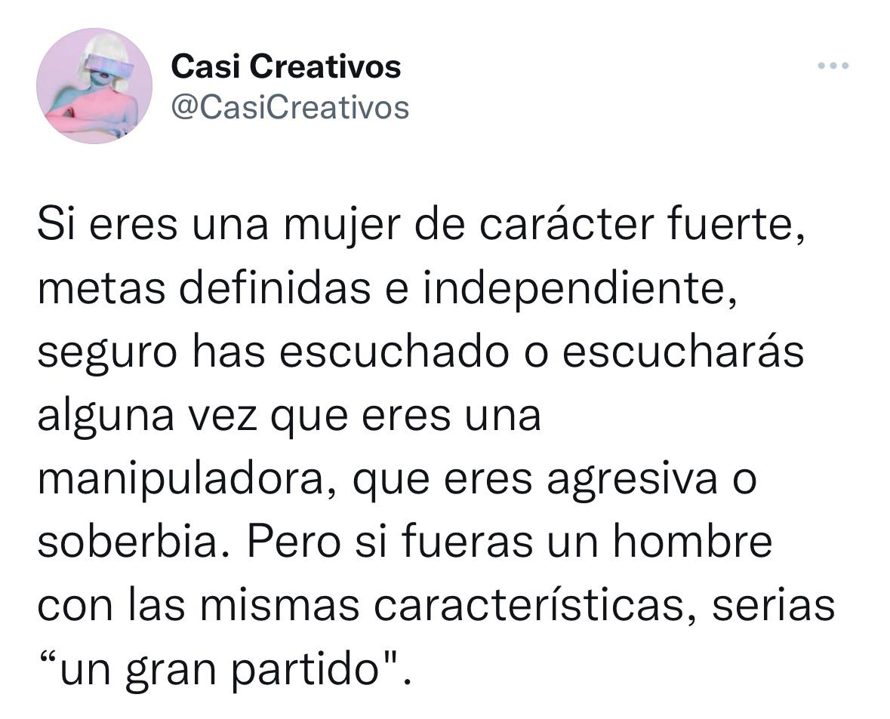

# CursoRMarkdown

En este repositorio se almacena el código y los archivos del curso de RMarkdown del programa New Dimensions.

Aquí va el siguiente parrafo. Este es un cuarto parrafo sin espacio.

Los profesores del New Dimensions son:

-   Diana
-   Alex
-   Angel
-   Chisthian
-   Alonso

Esta **palabra** está en negrita. Esta es otra forma de poner **negrita**.

La *cursiva*, en cambio, es con un solo asterisco.

Necesito tres ***asteriscos para que esté en negrita y cursiva a la vez***

# Insertamos una imagen

{width="376"}

{width="393"}

La página de New Dimensions es <https://www.dimensions.ai>\
También puedes ingresar haciendo click [aquí](https://www.dimensions.ai).
